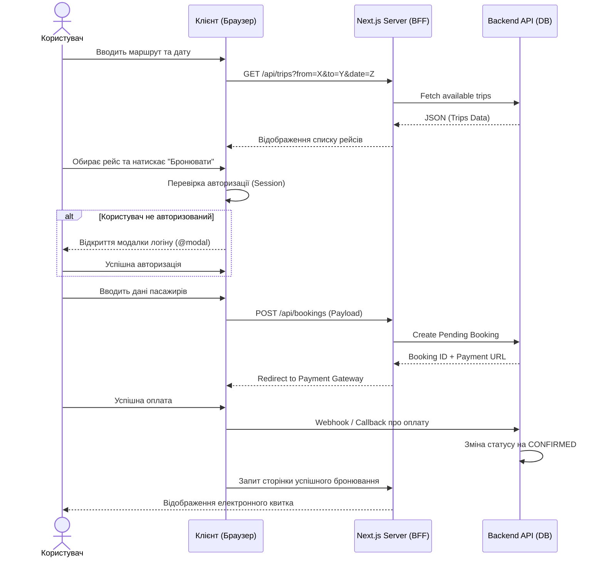

# Бізнес-процес: Бронювання квитків (Booking Flow)

Цей документ описує основний бізнес-процес додатку — пошук та бронювання автобусних квитків.

## Огляд процесу

Процес бронювання складається з наступних ключових етапів:
1. **Пошук рейсів:** Користувач обирає маршрут (Звідки - Куди), дату та кількість пасажирів на головній сторінці у віджеті `BookingForm`.
2. **Перегляд результатів:** Відображення списку доступних рейсів (`trips`), їх розкладу, вартості та наявності вільних місць.
3. **Вибір місця (опціонально):** Користувач може обрати конкретні місця в автобусі, якщо це передбачено конфігурацією рейсу.
4. **Введення даних пасажирів:** Введення персональних даних, контактної інформації для квитків.
5. **Оплата та підтвердження:** Інтеграція з платіжним шлюзом, після успішної оплати — генерація електронного квитка.

## Архітектура взаємодії (FSD)

У реалізації цього процесу беруть участь наступні модулі згідно з нашою архітектурою:

- `src/widgets/BookingForm` — Форма пошуку (UI + стан полів).
- `src/entities/trip` — API для запиту рейсів та моделі даних рейсу.
- `src/features/booking` (або аналогічний) — Логіка додавання рейсу в кошик, валідація даних користувача перед оплатою.

## Діаграма процесу бронювання (Sequence Diagram)

Нижче наведена Mermaid-діаграма, що ілюструє взаємодію клієнта, сервера (Next.js API/RSC) та зовнішнього бекенду (API перевізника/бази даних) під час бронювання.

## Управління станом форми пошуку

Віджет `BookingForm` використовує локальний стан (React `useState` або `react-hook-form` у комбінації з `zod` для валідації) для зберігання:
- `departureCityId`
- `arrivalCityId`
- `date`
- `passengersCount`

> **Важливо:** Дані пошуку часто синхронізуються з URL-параметрами (Search Params). Це робить результати пошуку Shareable (можна поділитися посиланням) і дозволяє Next.js ефективно кешувати запити на рівні сервера (Server Components).

## Обробка помилок

Під час процесу бронювання можливі наступні виняткові ситуації, які опрацьовуються на рівні UI:
1. **Відсутність рейсів:** Показується fallback компонент (Empty State) з пропозицією змінити дати.
2. **Втрата актуальності місць:** Якщо під час оплати місця були викуплені кимось іншим, бекенд повертає помилку `409 Conflict`, користувач перенаправляється назад з нотифікацією (`src/shared/ui/Notification`).
3. **Помилка платіжної системи:** Замовлення залишається в статусі `PENDING`, користувачу пропонується повторити спробу в особистому кабінеті (`src/pages-layer/profile-tickets`).
